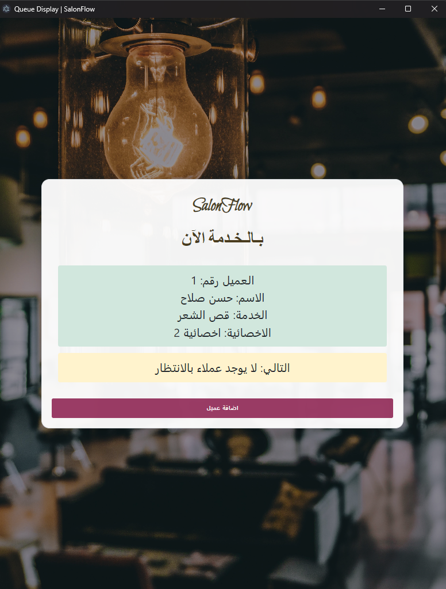

# SalonFlow - Salon Queue Management System

A modern salon queue management system built as an Electron desktop application, featuring real-time queue tracking and dual display functionality. The system uses HTML, JavaScript, and Electron for a responsive desktop experience with queue management and display interfaces.

## Features

- 🎫 Queue Management
  - Real-time queue tracking
  - Customer ticket generation
  - Service assignment
  - Specialist allocation

- 👩‍💼 Staff Management
  - Add/remove specialists
  - Track specialist workload
  - Service assignment

- 📺 Dual Display System
  - Admin management interface
  - Customer-facing queue display

- 🖨️ Ticket System
  - Print queue tickets
  - Customer information tracking
  - Service details

## Deployment Options

### Desktop Application
Package as a desktop application using Electron:

1. Requirements:
   - Node.js 14 or higher

2. Build steps:
   ```bash
   # Install Node.js dependencies
   npm install

   # Run as desktop app
   npm start

   # Build executable (optional)
   npm run dist
   ```

## Building Executable (Desktop Application)

### Prerequisites
- Node.js (version 14 or higher)
- npm (Node Package Manager)
- Windows, macOS, or Linux operating system

### Steps to Build Executable

1. **Install Electron Packager**
   ```bash
   npm install -g electron-packager
   ```

2. **Install Project Dependencies**
   ```bash
   npm install
   ```

3. **Build Executable for Different Platforms**

   #### For Windows
   ```bash
   electron-packager . SalonFlow --platform=win32 --arch=x64 --icon=path/to/icon.ico
   ```

   #### For macOS
   ```bash
   electron-packager . SalonFlow --platform=darwin --arch=x64 --icon=path/to/icon.icns
   ```

   #### For Linux
   ```bash
   electron-packager . SalonFlow --platform=linux --arch=x64
   ```

   **Note:** Replace `path/to/icon` with the actual path to your application icon.

### Customization Options
- `--platform`: Specify target platform (win32, darwin, linux)
- `--arch`: Specify architecture (x64, arm64)
- `--icon`: Custom application icon
- `--out`: Specify output directory for the executable

### Troubleshooting
- Ensure all dependencies are correctly installed
- Check that Electron Packager is globally installed
- Verify Node.js and npm are up to date

### Additional Configuration
Modify `package.json` to add custom build scripts or configuration for Electron packaging.

## Screenshots

### Application Icon

Application icon after building the executable.

### Main Interface and Client Management

The main dashboard combines queue overview and client management functionalities. It provides a comprehensive view of the current salon queue, displaying active customers, waiting times, and service statuses, while also offering an intuitive interface for adding new clients and managing their service information.

### Queue View Screen

Detailed queue management screen showing a full list of customers, their assigned services, waiting times, and real-time queue progression.


## Tech Stack

- **Core**:
  - Electron.js
  - Node.js
  - HTML/CSS/JavaScript

- **Frontend Libraries**:
  - Bootstrap (UI Framework)
  - SweetAlert2 for alerts
  - Toastr for notifications
  - KTDataTables/DataTables for data display

## Development

### Setup Development Environment

1. Clone the repository:
```bash
git clone https://github.com/HassanSalah120/salonflow.git
```

2. Install dependencies:
```bash
npm install
```

3. Start development:
```bash
npm start
```

## Contributing

1. Fork the repository
2. Create your feature branch (`git checkout -b feature/AmazingFeature`)
3. Commit your changes (`git commit -m 'Add some AmazingFeature'`)
4. Push to the branch (`git push origin feature/AmazingFeature`)
5. Open a Pull Request

## License

This project is licensed under the MIT License - see the [LICENSE](LICENSE) file for details.

## Acknowledgments

- Electron.js for desktop packaging capabilities
- Bootstrap for responsive design
- SweetAlert2 and Toastr for notifications
- KTDataTables/DataTables for data management
